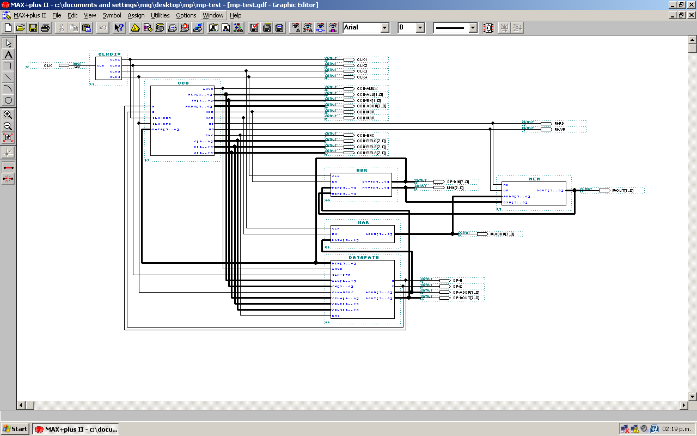
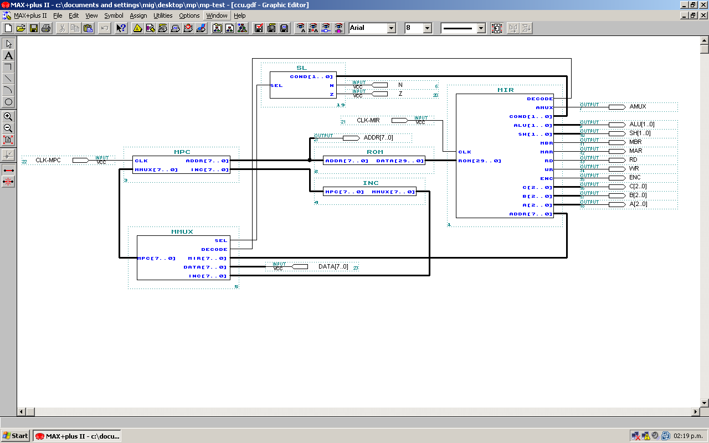
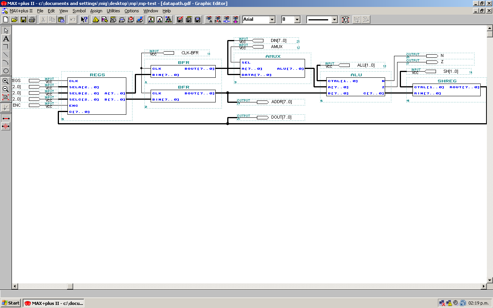
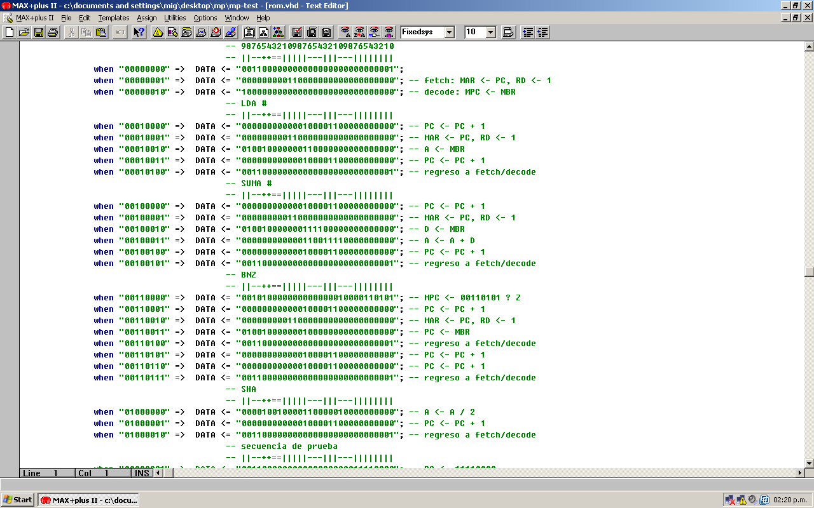
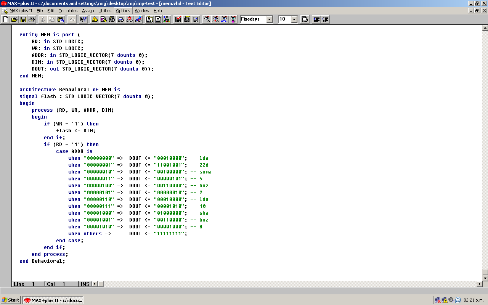
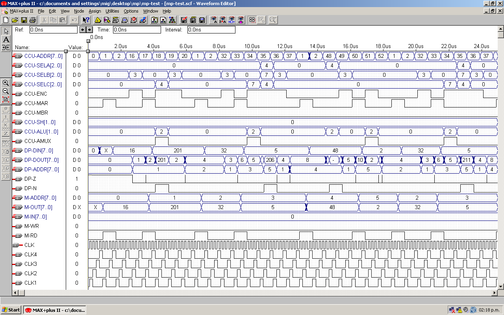

Microprocesador Von Neumann en VHDL
===================================

Proyecto final del curso **Arquitectura de Computadoras** impartido en
la [Facultad de Ingeniería](http://ingenieria.unam.mx) de la
[Universidad Nacional Autónoma de México](http://unam.mx).

El objetivo de este proyecto es implementar un microprocesador de tipo
[Von Neumann](http://es.wikipedia.org/wiki/Arquitectura_de_von_Neumann)
en [lenguaje VHDL](http://es.wikipedia.org/wiki/VHDL) dentro del
entorno [MAX+PLUS
II](http://www.altera.com/support/software/sof-maxplus2.html) y
validarlo en el
[FPGA](http://es.wikipedia.org/wiki/Field_Programmable_Gate_Array) de
una tarjeta de desarrollo [Altera](http://www.altera.com/).

Lenguaje ensamblador
--------------------

**LDA #opr**

- Opcode: 0x10
- Tamaño: 2 bytes
- Función: Carga el valor inmediato a la instrucción en el registro A.

**SUMA #opr**

- Opcode: 0x20
- Tamaño: 2 bytes
- Función: Suma el valor inmediato a la instrucción al valor en el registro A.

**SHA**

- Opcode: 0x40
- Tamaño: 1 byte
- Función: Corrimiento a la derecha del valor en el registro A.

**BNZ addr**

- Opcode: 0x30
- Tamaño: 2 bytes
- Función: Ramifica a la dirección de memoria inmediata a la instrucción en caso
de que el valor en el registro A sea diferente a cero.

Programa de prueba
------------------

```assembly
          LDA #226
ciclo-1	: SUMA #5
          BNZ ciclo-1
          LDA #10
ciclo-2	: SHA
          BNZ ciclo-2
```

Codificación en la memoria de programa:

Dirección | Valor | Ensamblador
--------- | ----- | -----------
0x00 | 0x10 | LDA
0x01 | 0xE2 | #226
0x02 | 0x20 | SUMA
0x03 | 0x05 | #5
0x04 | 0x30 | BNZ
0x05 | 0x02 | 2
0x06 | 0x10 | LDA
0x07 | 0x0A | #10
0x08 | 0x40 | SHA
0x09 | 0x30 | BNZ
0x0A | 0x08 | 8

Capturas de pantalla
--------------------

### Arquitectura



### Unidad de control



### Ruta de datos



### Microprogramación



### Memoria de programa



### Simulación



Autor
-----

Manuel Rábade <[manuel@rabade.net](mailto:manuel@rabade.net)>

Licencia
--------

Esta obra está bajo una [Licencia Pública General de GNU](LICENSE.txt).
